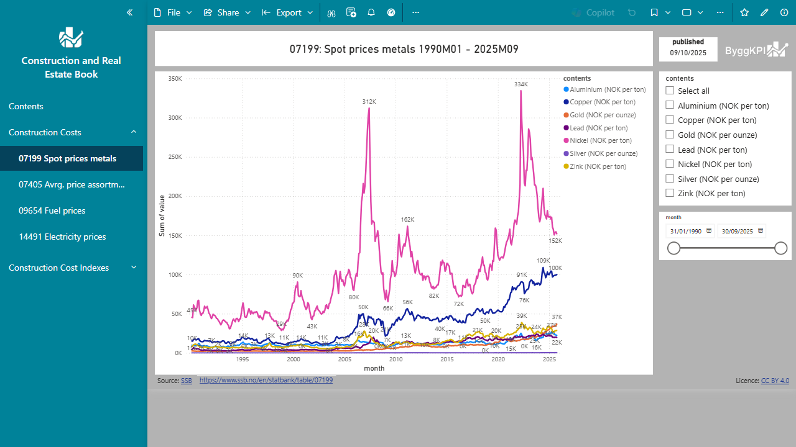

  

# Power BI: Bygge- og eiendomsbok

[![Install from Microsoft Store][badge]][store]

[badge]: https://img.shields.io/badge/Install_from-Microsoft_Store-blue?style=for-the-badge&logot&logoColor=white
[store]: https://marketplace.microsoft.com/en-us/product/power-bi/byggkpi1713816406537.a0001b_construction_and_real_estate_book

This Power BI app is under testing. It includes several interactive charts connected to public statistics databases of [Statistics Norway](https://www.ssb.no) about prices and indexes that are relevant about Norwegian Construction and Real Estate. All the text of the charts and sliders is in Norwegian.

Screenshot:

The current version includes, for example, the following datasets:

- Construction Costs:
    * Producer price index [07199: Spot prices metals](https://www.ssb.no/en/statbank/table/07199)
    * SCommercial roundwood removals [07405: Average price, by assortment (NOK per m³)](https://www.ssb.no/en/statbank/table/07405)
    * Sales of petroleum products and liquid biofuels [09654: Prices on engine fuel (NOK per litres)](https://www.ssb.no/en/statbank/table/09654)
    * Electricity prices [14491: Electricity prices in the end-user market, by contract type](https://www.ssb.no/en/statbank/table/09364)

It also includes 10 charts  in the group 'Construction Cost Indexes'.

> [!IMPORTANT]
> To have access to the app, it might be needed a Power BI Pro license.
> You have any doubt please send an email to [info@byggkpi.no](mailto:info@byggkpi.no?subject=[Power%20BI]%20Access%20Bygge-%20og%20eiendom%20app).

> [!NOTE]
> The updating of the datasets is implemented but under testing.

